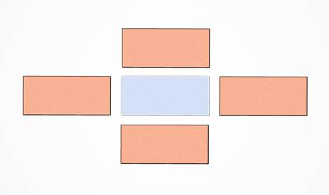

# 3DBinPacking
To package bin in Rear compartment with python.

# [車箱堆放行李箱情形-網頁](https://ecardjimmy.github.io/3DBinPacking/)

## 問題: 
車箱擺放大小不同行李箱的狀況(例:XXL, XL, L, M, S…).

## 思考:
	1. 擬人法 : 模擬人的擺法,長邊先擺,靠邊擺,大的箱子先擺…
	2. 貪心法: 優先擺大箱子(事實上擺小箱子可得最大填充率),箱子最長設為X方向,其次Y,其次Z
	3. 可放置點: 每個放置點上測試箱子的每個方向是否可放入(考慮放入最省空間位置由基線控制!?)
	4. 靠邊置放
	5. 砌磚法: 强制X方向擺完才能擺Y方向,整個'平面'擺完才能昇高Z擺放
	6. 模擬退火法: 最佳化(目前未考慮)
	7. 改變順序: XXL->XL->L… => L->XXL->S…
  	8. 改變方向: L.W.H -> W.H.L…

## 程式:
* Gui_BP.py
* DrawBox.py
* Packing3D.py
* MyMath.py

## 說明:
	1. 可放置點:
		* 如何增加/減少點

		* Z->X->Y 優先

	2. 箱子所有可能擺放方向(考慮24種)

		[ l, w, h],[ l, h, w],[ w, l, h],[ w, h, l],[ h, l, w],[ h, w, l]
		[ l,-w, h],[ l,-h, w],[ w,-l, h],[ w,-h, l],[ h,-l, w],[ h,-w, l]
		[-l, w, h],[-l, h, w],[-w, l, h],[-w, h, l],[-h, l, w],[-h, w, l] 
		[-l,-w, h],[-l,-h, w],[-w,-l, h],[-w,-h, l],[-h,-l, w],[-h,-w, l] 
	3. 基線: 確保箱子->X->Y->Z放置

	4. 干涉檢查: 
		*排除長方體所有不相交的狀況後,其他即為干涉
		
	
	
## 說明影片
- 車箱擺放計算原理

- 車箱擺放程式說明

- 車箱擺放程式執行

